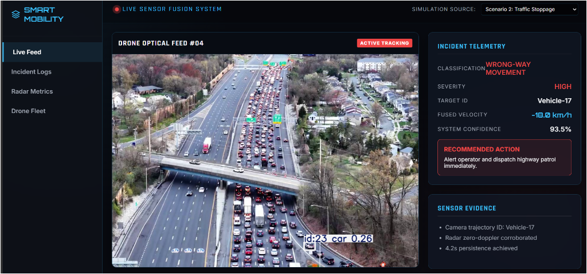

# 🚁 Smart Mobility & Road Incident Intelligence (Command Center)



<br/>

> **Challenge:** ELCIA Smart City Drone-AI Challenge 2026 - Track 1  
> **Focus:** Multi-Modal Edge AI for Autonomous Road Incident Intelligence  

---

## 🚀 The Proposed Ideology

Urban expressways, such as those in Electronics City, frequently experience dynamic and highly localized traffic incidents that rapidly propagate into severe network congestion. Conventional traffic monitoring heavily relies on fixed IP cameras, which suffer from **spatial blind spots**, **occlusion**, and **high transmission latency**.

**Our Solution:** A dynamic, drone-based edge-computing platform that fuses optical (Vision) and radio (Radar) telemetry locally at the edge. By shifting the computational workload to the drone's companion computer (e.g., NVIDIA Jetson), we dramatically reduce latency and false positive rates (FPR) for detecting critical anomalies like **Wrong-Way Driving** and **Stationary Blockages**.

---

## 🧠 System Architecture and Techniques

Our architecture is a deterministic, multi-modal pipeline designed for extreme reliability in harsh urban environments:

1. **Optical Vision Pipeline (YOLOv8 + BoT-SORT):** 
   - We utilize `ultralytics` YOLOv8 for high-speed, lightweight spatial object localization, extracting bounding box tensor arrays.
   - To maintain persistent vehicle identities across consecutive frames despite partial occlusions, we utilize BoT-SORT (ByteTrack with ReID) for temporal tracking.
2. **Radar DSP Pipeline (FFT Velocity Extraction):** 
   - To overcome the limitations of monocular depth estimation, a millimeter-wave (mmWave) radar operates concurrently. 
   - We perform Fast Fourier Transform (FFT) utilizing a Hanning window to mitigate spectral leakage, isolating the peak Doppler frequency shift to yield absolute longitudinal velocity with sub-meter-per-second precision.
3. **Late Sensor Fusion & State Logic:** 
   - Vision-derived spatial trajectories are associated with Radar-derived doppler velocities using an IoU cost matrix. 
   - A deterministic state machine evaluates the fused data to trigger alerts based on negative velocity persistence (Wrong-Way) or zero-doppler persistence (Blockage).
4. **LoRaWAN Edge Transmission:** 
   - Rather than streaming high-bandwidth 1080p video to the cloud, the edge node transmits only lightweight JSON payloads containing the fused telemetry over LoRaWAN/MQTT, guaranteeing sub-2-second alert latency.

---

## 📁 Directory Structure

```text
road-incident-intelligence/
├── dashboard/                 # Flask web application for real-time visualization
│   ├── templates/
│   │   └── index.html         # Ultra-modern full-screen Command Center UI
│   └── app.py                 # Backend streaming MJPEG and live telemetry API
├── fusion/
│   └── sensor_fusion.py       # Sensor fusion data association logic
├── incident_logic/
│   └── wrong_way_detector.py  # Temporal state machines for incident flags
├── lora/
│   └── payload_manager.py     # JSON payload compaction for LoRaWAN
├── radar_dsp/
│   └── fft/
│       └── velocity_extractor.py # scipy.fft Doppler frequency analysis
├── test_videos/               # Drone footage test scenarios
├── vision/
│   ├── detection/
│   │   └── yolov8_detector.py # Optical localization (YOLOv8)
│   └── tracking/
│       └── deepsort_tracker.py # BoT-SORT / ByteTrack temporal tracking
├── outputs/                   # Dynamically generated AI telemetry
├── main_edge_pipeline.py      # Core processing loop running the inference
└── README.md
```

---

## ⚠️ Important Disclaimer (Demo Mode)

**This repository represents a fully functional, end-to-end prototype.** 
However, it is currently operating in **DEMO MODE**. 

What does this mean?
- **Multi-Modal AI Pipeline:** While the core architecture is multi-modal (Vision + Radar), the optical vision component of this demonstration uses a pre-trained base YOLOv8 model (`yolov8n.pt`) to prove the architecture's capability to process video, track objects, apply math, and render the live MJPEG stream to the dashboard. The Radar component is simulated via software.
- **Pending Execution:** The core pending task for final deployment is the execution of our custom model training pipeline. We will fine-tune the YOLO weights on a custom, hyper-specific dataset (like UIT-ADrone) of top-down aerial traffic anomalies to maximize optical precision for this exact use case.
- **Radar Simulation:** Since physical radar hardware is not connected during this software demonstration, the `scipy.fft` pipeline is fed simulated Intermediate Frequency (IF) sine waves to demonstrate the DSP math and sensor fusion working in real-time.
- **Test Videos Included:** To effectively demonstrate the system's capabilities in the absence of live drone feeds, we have included specific testing scenarios in the `test_videos/` directory:
  - `wrong_way_drone1.mp4`: Demonstrates the system's ability to detect and flag vehicles traveling against the flow of traffic.
  - `drone_stoppage.mp4`: Tests the zero-doppler detection logic for identifying stationary blockages and traffic jams.
  - `sample_traffic_mock.mp4`: Serves as a normal baseline to verify the system avoids false positives during regular flow.

---

## 💻 Running the Live Command Center

We have built a stunning, live-streaming MJPEG Command Center to visualize the AI in action.

### 1. Install Dependencies
```bash
pip install -r requirements.txt
# OR manually:
pip install flask ultralytics opencv-python scipy numpy filterpy lapx
```

### 2. Start the AI Server
Open a terminal in the `dashboard/` directory and start the Flask engine. This engine will load the YOLO model, read the test drone videos, process the frames, and stream the telemetry.
```bash
cd dashboard
python app.py
```

### 3. Open the Dashboard
Navigate to [http://127.0.0.1:5000](http://127.0.0.1:5000) in your web browser. 

You will see the YOLOv8 model actively drawing bounding boxes on the video stream in real-time while the telemetry panels dynamically update with the fused logic states. You can switch between the provided test scenarios using the dropdown!

---

**Team:** TECHTRONICS  
**Participants:** DHAMARAI KANNAN A, SENTHOOR KUMARAN S  
**Institution:** CHENNAI INSTITUTE OF TECHNOLOGY  
**State:** TAMIL NADU  
